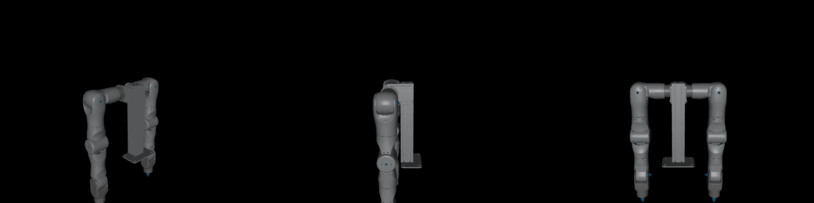

# OneRobotics A1 — Isaac Lab Integration

[OneRobotics](http://www.onerobot.com/) develops the **OneRobotics A1**, a 7-DoF fixed-base robotic arm.


*OneRobotics A1 at the all-joint-zero pose in the Isaac Lab reach environment.*



*Three-view render of the published OneRobotics A1 bimanual-with-stand source
model at the all-joint-zero pose. This CAD revision contains two 7-DoF arms and
no gripper.*

> This repository is the canonical public review source for the OneRobotics A1
> assets consumed by the current Isaac Lab contribution. It also retains the
> legacy external Isaac Lab extension for existing users.

The repository provides an Isaac Lab articulation configuration, a manager-based end-effector reach task, RSL-RL training and playback scripts, and a MuJoCo sim-to-sim validation path. It is not an official Isaac Lab asset or task.

## Gazebo Harmonic / Fuel

Start with the [Gazebo beginner viewing guide](gazebo/README.md) for one-time
setup and the local launcher. Organization-authorized maintainers who need the
full approval, manifest, handoff, and post-publication procedure should use the
[authorized maintainer publication guide](gazebo/PUBLISHING.md). Neither guide
performs an upload.

## Project status

- The Isaac Lab maintainer direction in [Issue #7095](https://github.com/isaac-sim/IsaacLab/issues/7095)
  is to contribute the **OneRobotics A1 asset and Reach environment together**.
- The review branch targets current Isaac Lab `develop`: robot configurations
  live in `isaaclab_assets`, while the Reach environments live under
  `isaaclab_tasks/contrib/reach` alongside the OpenArm contribution.
- The current candidate is
  [`T1Amoo/IsaacLab:contrib/onerobotics-a1-reach`](https://github.com/T1Amoo/IsaacLab/tree/contrib/onerobotics-a1-reach).
  Its unimanual task mounts the standalone A1 directly on the scene-local core
  Reach table; the table is not part of this robot asset repository.
- The source assets in this repository are public review-stage inputs. Final
  NVIDIA legal approval and any maintainer-requested hosted-asset migration are
  still pending; no NVIDIA Nucleus path is claimed here.
- The legacy `h1_reach` package name and `Template-A1-Reach-*` Gym IDs are intentionally retained during Phase 1 to avoid breaking existing users.
- An authentic Isaac Lab render is included above. The underlying OneRobotics A1 model is covered by the asset license described below; third-party Isaac Lab/Isaac Sim scene elements in the screenshot remain subject to their own terms.

## Current Isaac Lab contribution snapshot

As of 2026-08-31, the candidate contribution is aligned as follows:

| Item | Value |
| --- | --- |
| upstream base | `isaac-sim/IsaacLab@630317ba1ff900c120a65e705a688b9514f353a8` |
| contribution HEAD | `T1Amoo/IsaacLab@0bdc2be11330ddd0fd952c281022c93d2b9c6dc7` |
| ahead / behind | `7 / 0` |
| unimanual configuration | `ONEROBOTICS_A1_UNIMANUAL_CFG` |
| bimanual configuration | `ONEROBOTICS_A1_BIMANUAL_CFG` |
| unimanual task | `IsaacContrib-Reach-OneRobotics-A1` |
| bimanual task | `IsaacContrib-Reach-OneRobotics-A1-Bimanual` |

The unimanual specialization inherits core Reach's scene-local static cuboid
table, whose top is at environment-local `z=0`. The environment places the A1
root at `(0.1, 0.0, 0.01575)` m with XYZW rotation `(0.0, 0.0, 1.0, 0.0)`.
The `0.01575` m offset is derived from the canonical base mesh minimum Z, so the
base has zero geometric clearance from the tabletop. No pedestal, combined
robot/table model, or table-to-robot joint is used.

This scene refinement did not change the public robot asset, robot physics,
actuator parameters, FK, rewards, observations, actions, PPO configuration,
target sampling, or bimanual implementation. In a deterministic 4096-target
check, 98.5596% of Link7 targets were above or on the tabletop, so the target
distribution was retained unchanged.

Post-rebase validation passed formatting, all seven focused asset tests, both
focused unimanual Reach tests, all three focused bimanual Reach tests, task
discovery, and `git diff --check`. The earlier 256-environment/500-step GPU
finite-state smokes and 256-environment/5-iteration RSL-RL integration smokes
also passed for both tasks. They were not repeated after the final rebase
because the intervening upstream commits did not touch the A1 runtime path;
these are integration checks, not convergence claims.

The branch is **ready for a Draft PR**, while NVIDIA legal approval and the
final asset-hosting decision remain merge gates. No upstream PR has been opened
and no comment has been posted to Issue #7095. See the
[current compare view](https://github.com/isaac-sim/IsaacLab/compare/develop...T1Amoo:IsaacLab:contrib/onerobotics-a1-reach).

## Features

- `A1_RIGHT_CFG`: fixed-base OneRobotics A1 right-arm articulation with seven joints, implicit PD actuators, effort and velocity limits, and configured armature.
- Portable asset loading: Isaac Lab imports the packaged A1 URDF at runtime instead of referencing a developer-local USD path.
- `assets/urdf/A1_2026/`: publication-source inventory containing two
  independent 7-DoF arm URDFs and a distinct whole-robot bimanual stand URDF,
  with 33 referenced meshes and shared model/control metadata. These are
  separate CAD revisions; none includes a gripper.
- Manager-based reach task derived from Isaac Lab's manipulation reach example.
- Reachable-by-construction pose commands sampled from joint limits and evaluated with forward kinematics.
- Position-and-orientation observations and multi-scale pose rewards.
- RSL-RL training and policy playback.
- MuJoCo sim-to-sim playback with position-servo and explicit motor-PD modes.

## Software compatibility

The legacy external extension in this repository was validated against Isaac Lab
`release/3.0.0-beta2`; its historical commands and Gym IDs remain unchanged. The
separate upstream contribution is maintained against current Isaac Lab
`develop` and consumes the `A1_2026` model files in this repository through a
portable review-stage asset loader. It does not import this legacy extension's
task or actuator configuration. These two compatibility statements should not
be conflated.

The following versions were available for local validation on 2026-08-14:

| Component | Version or baseline |
| --- | --- |
| Python | 3.12.13 |
| Isaac Sim | 6.0.1.0 |
| Local Isaac Lab runtime | dirty `v3.0.0-beta` checkout at `a4a7602` |
| Isaac Lab API review target | `release/3.0.0-beta2` at `2e44ddb` |
| RSL-RL | 5.0.1 |
| MuJoCo | 3.8.0 |

The exact checks performed, including checks that could not be run against an installed beta2 runtime, are recorded in [`OPEN_SOURCE_PREP.md`](OPEN_SOURCE_PREP.md).

## Installation

Install Isaac Lab first, activate its Python 3.12 environment, then clone and install this external extension:

```bash
git clone https://github.com/katazen/onerobot_h1.git
cd onerobot_h1
python -m pip install -e source/h1_reach
```

The extension assumes that `isaaclab`, `isaaclab_tasks`, and `isaaclab_rl` are supplied by the selected Isaac Lab installation. MuJoCo validation is optional and requires the `mujoco` Python package in the environment used to run `scripts/sim2sim.py`.

## Training and playback

List the two legacy Gym registrations:

```bash
python scripts/list_envs.py
```

Start RSL-RL training:

```bash
python scripts/rsl_rl/train.py \
  --task=Template-A1-Reach-v0 \
  --num_envs=2048 \
  --headless
```

Play a trained checkpoint:

```bash
python scripts/rsl_rl/play.py \
  --task=Template-A1-Reach-Play-v0 \
  --checkpoint=/absolute/path/to/model.pt
```

This repository does not include a pre-trained policy. The play script exports a successful RSL-RL checkpoint to an `exported/policy.pt` file alongside the selected run.

## MuJoCo sim-to-sim validation

Pass the exported TorchScript policy explicitly so the script remains portable across clones:

```bash
python scripts/sim2sim.py \
  --policy=/absolute/path/to/exported/policy.pt \
  --control-mode=motor \
  --policy-quaternion-layout=xyzw
```

Isaac Lab `release/3.0.0-beta2` uses `xyzw` quaternions, while MuJoCo exposes `wxyz`; the explicit flag converts only the policy observation fields. The script retains `wxyz` as its default for compatibility with policies trained using the legacy sim2sim observation contract. `--control-mode=position` selects MuJoCo position servos. The default `motor` mode computes the configured PD torque explicitly and clips it to the same per-joint effort limits. This cleanup does not change the MJCF dynamics, geometry, control gains, or legacy default behavior.

## Repository layout

```text
scripts/
  list_envs.py                 # list the external project's Gym environments
  rsl_rl/{train,play}.py       # RSL-RL training and playback
  sim2sim.py                   # MuJoCo sim-to-sim playback
source/h1_reach/
  config/extension.toml        # Omniverse/Isaac Lab extension metadata
  h1_reach/
    robots/a1.py               # OneRobotics A1 articulation configuration
    tasks/manager_based/
      h1_reach/                # legacy package path for the reach task
    assets/
      urdf/A1_2026/            # current single-arm and bimanual-stand sources
      urdf/A1/                 # legacy single-arm URDF model inventory
      urdf/A1_dual/            # legacy dual-arm URDF model inventory
      meshes/                  # STL geometry
      mjcf/                    # MuJoCo models
```

The `robots/a1.py` module does not import reach-task code. The legacy top-level package still registers the task eagerly, so final package separation and lazy exports remain a Phase 2 decision.

## Licensing

This repository uses a clear code-and-assets license split:

- **Python and other project code:** BSD-3-Clause, `Copyright (c) 2026, OneRobotics`; see [`LICENSE`](LICENSE).
- **OneRobotics A1 robot assets:** CC BY 4.0, `Copyright © 2026 OneRobotics`. This scope includes the listed URDF, MJCF/XML and STL files, the A1 2026 model/control metadata YAML, and covered USD conversions published by OneRobotics from them. Attribution and an indication of changes are required; see [`ASSET_LICENSE_STATUS.md`](ASSET_LICENSE_STATUS.md) and the full [`CC BY 4.0 license text`](LICENSES/CC-BY-4.0.txt).
- **Isaac Lab-derived files:** retained upstream Isaac Lab Project Developers copyright and BSD-3-Clause notices; see [`THIRD_PARTY_NOTICES.md`](THIRD_PARTY_NOTICES.md).

Recommended asset attribution: `OneRobotics A1 robot assets © 2026 OneRobotics, licensed under CC BY 4.0 (https://creativecommons.org/licenses/by/4.0/). Source: https://github.com/katazen/onerobot_h1. Changes: none.` Replace `none` with a short description when redistributing modified assets.

## Upstream contribution

The public proposal is [Isaac Lab Issue #7095](https://github.com/isaac-sim/IsaacLab/issues/7095).
The maintainer requested the asset and environment together and directed the
Reach environment to `source/isaaclab_tasks/isaaclab_tasks/contrib/reach`.
The contribution branch now contains the table-mounted fixed-base right-arm
task plus the hardware-team-supplied bimanual-with-stand model and task. The
table mount belongs only to the unimanual Reach scene; the canonical right-arm
asset remains standalone. The branch is being reviewed before an upstream PR
is opened. Technical acceptance and NVIDIA legal approval of the asset are
separate remaining review gates.

The exact source bytes used by the Isaac Lab review branch are recorded in
[`A1_2026/SHA256SUMS`](source/h1_reach/h1_reach/assets/urdf/A1_2026/SHA256SUMS).
This review manifest does not claim NVIDIA legal approval or a final hosted
asset URI.

See [`OPEN_SOURCE_PREP.md`](OPEN_SOURCE_PREP.md) for the original Phase 1 audit,
historical test results, licensing record, and Phase 2 plan recorded on
2026-08-14. The current contribution status is the snapshot above.
